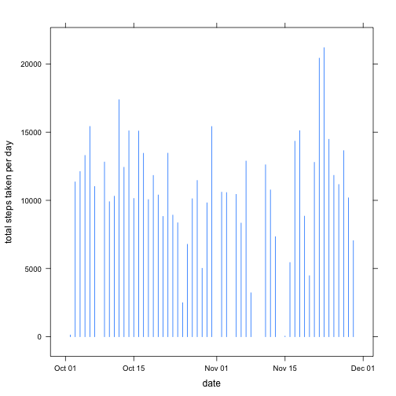
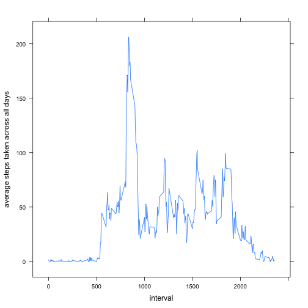
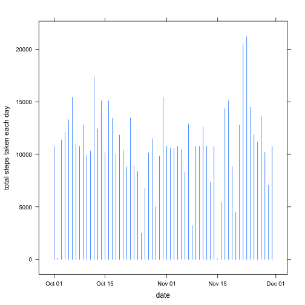
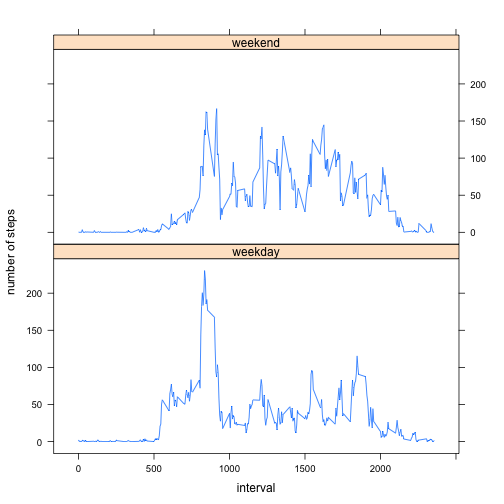

# Reproducible Research: Peer Assessment 1


## Loading and preprocessing the data

```r
setwd("/Users/ximi/Documents/coursera_datasci/RepData_PeerAssessment1")
raw<-read.csv("activity.csv", 
              na.strings="NA",
              colClasses=c("numeric", "Date", "numeric"))
complete<-!is.na(raw$steps)
data<-raw[complete,]
```

## What is mean total number of steps taken per day?

```r
library(lattice)
daytot<-aggregate(data$steps,list(data$date), sum)
colnames(daytot)<-c("date","steps")
xyplot(daytot$steps ~ daytot$date, type="h", xlab="date", ylab="total steps taken per day")
```

 

```r
meantot<-mean(daytot$steps)
mediantot<-median(daytot$steps)
```

The mean and median total number of steps are 1.0766 &times; 10<sup>4</sup> and 1.0765 &times; 10<sup>4</sup>, respectively.

## What is the average daily activity pattern?

```r
activity<- aggregate(data$steps, list(data$interval), mean)
colnames(activity)<- c("interval", "steps")
xyplot(activity$steps ~ activity$interval, xlab="interval", type="l", ylab="average steps taken across all days")
```

 

```r
max_interval<- match(max(activity$steps), activity$steps)
max_interval<- activity$interval[max_interval]
```

The interval that contains the maximum number of steps is the one from 830 to 835.

## Imputing missing values

```r
missing<-nrow(raw) - nrow(data)
#filling data to NAs
for(i in seq(nrow(raw))){
    if(is.na(raw$steps[i])){
        index<- match(raw$interval[i], activity$interval)
        raw$steps[i]<- activity$steps[index]
    }
}
daytot_new<- aggregate(raw$steps, list(raw$date), sum)
colnames(daytot_new)<- c("date", "steps")
xyplot(daytot_new$steps ~ daytot_new$date, type="h", xlab="date", ylab="total steps taken each day")
```

 

```r
meantot_new<-mean(daytot_new$steps)
mediantot_new<-median(daytot_new$steps)
```

There are 2304 missing cases. Filling the missing cases with averaged step across all days for that interval, a new dataset is created. The mean and median total number of steps are 1.0766 &times; 10<sup>4</sup> and 1.0766 &times; 10<sup>4</sup>, respectively. Compared with the first part, which has mean and median as 1.0766 &times; 10<sup>4</sup> and 1.0765 &times; 10<sup>4</sup>, the results do not differ very much.

## Are there differences in activity patterns between weekdays and weekends?


```r
days<- weekdays(raw$date)
wkend<- c("Saturday", "Sunday")
iswkday<- function(someday){
    if(someday %in% wkend) {someday<- "weekend"}
    else { someday<- "weekday"}
}
f<-sapply(days,iswkday)
f<-factor(f)
raw$f<-f
tmp<-split(raw,f)

wk<- data.frame(tmp[1])
wk<- aggregate(wk$weekday.steps, list(wk$weekday.interval), mean)
colnames(wk)<-c("interval", "steps")
wk_flag<- rep("weekday", nrow(wk))
wk$flag<- wk_flag

wkend<- data.frame(tmp[2])
wkend<- aggregate(wkend$weekend.steps, list(wkend$weekend.interval), mean)
colnames(wkend)<-c("interval", "steps")
wkend_flag<- rep("weekend", nrow(wkend))
wkend$flag<- wkend_flag

raw<-rbind(wk,wkend)
xyplot(raw$steps ~ raw$interval | raw$flag, type="l", xlab="interval", ylab="number of steps", layout=c(1,2))
```

 
